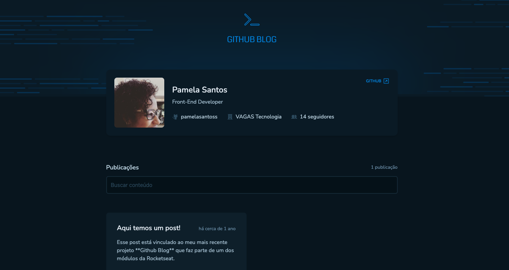

# Github Blog




## Description

A single-page application that transforms GitHub issues into blog posts. The app fetches repository issues via the GitHub API, lists them as articles, allows searching/filtering, and renders each issue's Markdown content as a readable article. Built with React, TypeScript and Vite, styled with Tailwind CSS.

The app allows users to:
- View a profile header with basic GitHub user information
- Browse a list of articles from a configured GitHub repository
- Search and filter articles by text query
- Open a article to read its full content rendered from Markdown
- See article metadata: author, publish date, comments count, and links back to the original GitHub issue
- Navigate between home and article pages using client-side routing

## Features
- 📱 Responsive layout with header and content area
- 🗂️ Issue listing presented as cards with summary and meta information
- ⏱️ Date formatting (relative and absolute) for posts and metadata
- 🔍 Search form with validation and debounced search behavior
- 🧾 Markdown rendering for full article content
- 🔗 Integration with the GitHub REST API to fetch profile and issues
- ⚙️ Centralized Axios instance for all API requests
- 🧭 Client-side routing for smooth article navigation
- 🛡️ Form validation via Zod combined with react-hook-form
- 🎨 Tailwind CSS for utility-first, responsive styling

## Technologies

- [Vite](https://vitejs.dev/)
- [ReactJS](https://react.dev/learn)
- [TypeScript](https://www.typescriptlang.org/)
- [Tailwind](https://tailwindcss.com/)
- [Context API](https://legacy.reactjs.org/docs/context.html)
- [React Router Dom](https://reactrouter.com/)
- [React Hook Form](https://react-hook-form.com/)
- [Zod](https://zod.dev/)
- [date-fns](https://date-fns.org/)
- [React Markdown](https://github.com/remarkjs/react-markdown)
- [Phosphor Icons](https://phosphoricons.com/)

## Getting Started

### Prerequisites

- Node.js v19 or higher

### Installation

1. Install dependencies:
    ```bash
    git clone https://github.com/pamelasantoss/ignite-github-blog.git
    cd ignite-github-blog
    npm install
    ```

2. Create environment file:
   - Copy `.env.default` to `.env` and fill values:
     - VITE_GITHUB_USER - GitHub username to fetch profile data
     - VITE_GITHUB_REPO_ISSUES - repo path in "owner/repo" format to fetch issues

3. Start development server:
    ```bash
    npm run dev
    ```

Visit [http://localhost:5173](http://localhost:5173) to view the app.

### Production Build

```bash
npm run build
npm run preview
```

## Project Structure
- src/
  - main.tsx — application bootstrap
  - App.tsx — root component and providers
  - Routes.tsx — route definitions
  - lib/
    - axios.ts — configured Axios instance for GitHub API
  - contexts/
    - IssuesContext/ — fetches and stores issues; exposes search API
  - hooks/
    - useGithubUserData/ — fetches GitHub profile metadata
  - components/
    - Header, CardIntro, CardIssue, SearchForm, CardIntroIssue, etc.
  - pages/
    - Home — lists issues and includes search
    - Article — fetches and renders an individual issue as Markdown
  - layouts/
    - DefaultLayout — shared layout and header
  - styles/
    - index.css — Tailwind entry + custom fonts
- .env.default — environment variables template
- vite.config.ts — Vite configuration
- tailwind.config.js — Tailwind setup

## Learning Goals

This project was developed to practice and demonstrate:
- Consume a public REST API and handle remote data in a React app
- Manage global state with Context API for cross-cutting concerns (issues list, search)
- Build accessible and responsive UI using Tailwind CSS
- Validate and manage form state with react-hook-form + Zod
- Render Markdown content safely in React with react-markdown
- Configure a modern frontend toolchain (Vite, TypeScript, ESLint, Prettier, Husky)
- Implement client-side routing and page-level data fetching

## Contributing

Contributions are welcome! Feel free to open issues or submit pull requests.

## Notes for contributors

- Follow existing code style as patterns for components, hooks, and contexts
- The repository expects public GitHub data. For higher rate limits, consider adding a token to the Axios instance (not included by default).
- Ensure VITE_GITHUB_REPO_ISSUES uses the format `owner/repo`.

## License

This project is under the MIT license. See the [LICENSE](https://github.com/pamelasantoss/ignite-github-blog/blob/main/LICENSE) file for details.

---

Made with ❤️ by [Pamela Santos](https://pamelasantos.dev.br/)